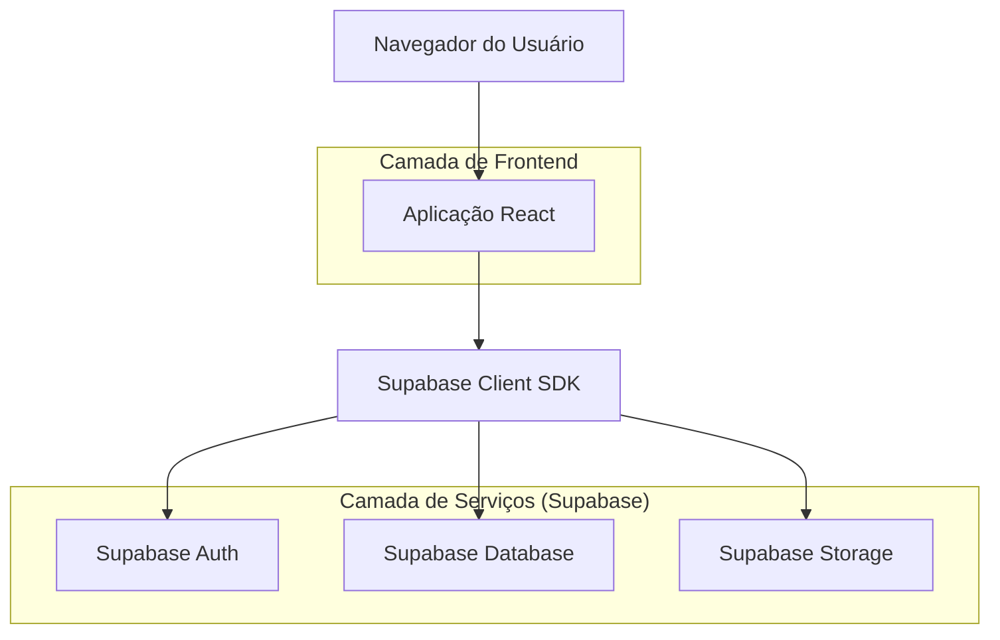
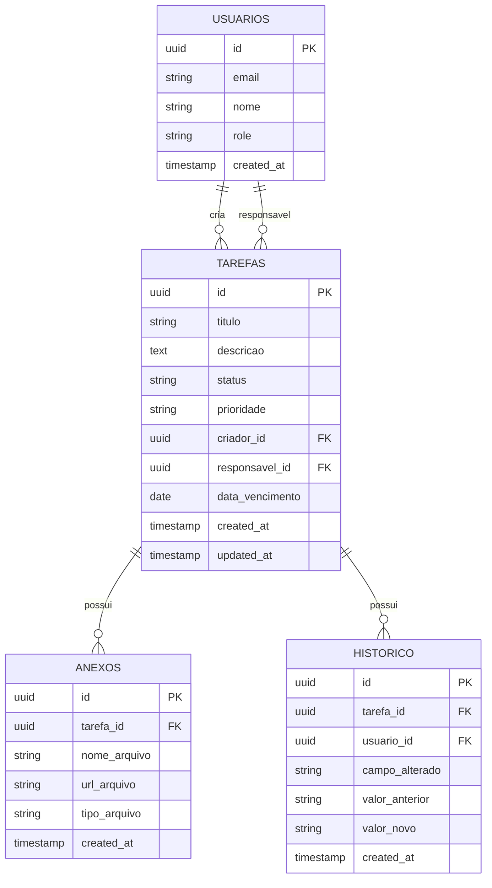

## 1. Arquitetura do Sistema



## 2. Tecnologias Utilizadas

- **Frontend**: React@18 + TypeScript + TailwindCSS@3 + Vite
- **Ferramenta de Inicialização**: vite-init
- **Backend**: Supabase (BaaS)
- **Banco de Dados**: PostgreSQL (via Supabase)
- **Autenticação**: Supabase Auth
- **Storage**: Supabase Storage (para anexos)

## 3. Definições de Rotas

| Rota | Propósito |
|------|-----------|
| /tarefas | Lista principal de tarefas com filtros |
| /tarefas/nova | Formulário para criar nova tarefa |
| /tarefas/:id | Visualização detalhada da tarefa |
| /tarefas/:id/editar | Formulário para editar tarefa existente |

## 4. Definições de API

### 4.1 Operações CRUD de Tarefas

**Listar tarefas com filtros**
```
GET /api/tarefas?status=&prioridade=&responsavel=&data_vencimento=
```

**Criar nova tarefa**
```
POST /api/tarefas
```

Request:
| Parâmetro | Tipo | Obrigatório | Descrição |
|-----------|------|-------------|-----------|
| titulo | string | sim | Título da tarefa |
| descricao | string | não | Descrição detalhada |
| status | string | sim | Status inicial (pendente, em_andamento, concluida) |
| prioridade | string | sim | Prioridade (alta, media, baixa) |
| responsavel_id | uuid | sim | ID do usuário responsável |
| data_vencimento | date | não | Data de vencimento |

**Atualizar tarefa**
```
PUT /api/tarefas/:id
```

**Excluir tarefa**
```
DELETE /api/tarefas/:id
```

## 5. Modelo de Dados

### 5.1 Definição do Modelo



### 5.2 DDL - Linguagem de Definição de Dados

**Tabela de Tarefas**
```sql
-- criar tabela
CREATE TABLE tarefas (
    id UUID PRIMARY KEY DEFAULT gen_random_uuid(),
    titulo VARCHAR(255) NOT NULL,
    descricao TEXT,
    status VARCHAR(20) NOT NULL CHECK (status IN ('pendente', 'em_andamento', 'concluida')),
    prioridade VARCHAR(20) NOT NULL CHECK (prioridade IN ('alta', 'media', 'baixa')),
    criador_id UUID NOT NULL REFERENCES auth.users(id),
    responsavel_id UUID NOT NULL REFERENCES auth.users(id),
    data_vencimento DATE,
    created_at TIMESTAMP WITH TIME ZONE DEFAULT NOW(),
    updated_at TIMESTAMP WITH TIME ZONE DEFAULT NOW()
);

-- criar índices
CREATE INDEX idx_tarefas_status ON tarefas(status);
CREATE INDEX idx_tarefas_prioridade ON tarefas(prioridade);
CREATE INDEX idx_tarefas_responsavel ON tarefas(responsavel_id);
CREATE INDEX idx_tarefas_vencimento ON tarefas(data_vencimento);
CREATE INDEX idx_tarefas_criador ON tarefas(criador_id);
```

**Tabela de Anexos**
```sql
CREATE TABLE anexos (
    id UUID PRIMARY KEY DEFAULT gen_random_uuid(),
    tarefa_id UUID NOT NULL REFERENCES tarefas(id) ON DELETE CASCADE,
    nome_arquivo VARCHAR(255) NOT NULL,
    url_arquivo TEXT NOT NULL,
    tipo_arquivo VARCHAR(100) NOT NULL,
    created_at TIMESTAMP WITH TIME ZONE DEFAULT NOW()
);

CREATE INDEX idx_anexos_tarefa ON anexos(tarefa_id);
```

**Tabela de Histórico**
```sql
CREATE TABLE historico_alteracoes (
    id UUID PRIMARY KEY DEFAULT gen_random_uuid(),
    tarefa_id UUID NOT NULL REFERENCES tarefas(id) ON DELETE CASCADE,
    usuario_id UUID NOT NULL REFERENCES auth.users(id),
    campo_alterado VARCHAR(50) NOT NULL,
    valor_anterior TEXT,
    valor_novo TEXT,
    created_at TIMESTAMP WITH TIME ZONE DEFAULT NOW()
);

CREATE INDEX idx_historico_tarefa ON historico_alteracoes(tarefa_id);
CREATE INDEX idx_historico_usuario ON historico_alteracoes(usuario_id);
```

### 5.3 Permissões e Políticas de Segurança

```sql
-- conceder acesso básico para usuários anônimos (leitura apenas)
GRANT SELECT ON tarefas TO anon;
GRANT SELECT ON anexos TO anon;

-- conceder acesso completo para usuários autenticados
GRANT ALL PRIVILEGES ON tarefas TO authenticated;
GRANT ALL PRIVILEGES ON anexos TO authenticated;
GRANT ALL PRIVILEGES ON historico_alteracoes TO authenticated;

-- políticas de segurança row level security (RLS)
ALTER TABLE tarefas ENABLE ROW LEVEL SECURITY;
ALTER TABLE anexos ENABLE ROW LEVEL SECURITY;
ALTER TABLE historico_alteracoes ENABLE ROW LEVEL SECURITY;

-- permitir que usuários vejam apenas tarefas onde são criadores ou responsáveis
CREATE POLICY "Usuários podem ver próprias tarefas" ON tarefas
    FOR SELECT USING (
        auth.uid() = criador_id OR auth.uid() = responsavel_id
    );

-- permitir que usuários criem tarefas
CREATE POLICY "Usuários podem criar tarefas" ON tarefas
    FOR INSERT WITH CHECK (auth.uid() = criador_id);

-- permitir que usuários atualizem tarefas onde são responsáveis
CREATE POLICY "Responsáveis podem atualizar tarefas" ON tarefas
    FOR UPDATE USING (auth.uid() = responsavel_id)
    WITH CHECK (auth.uid() = responsavel_id);
```