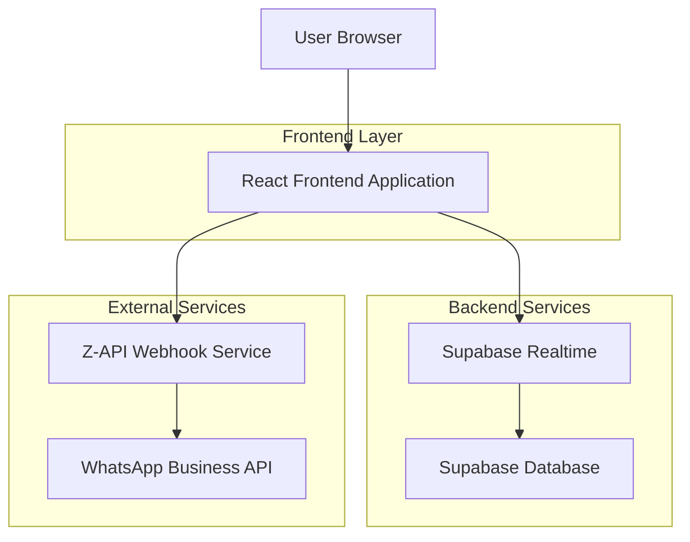
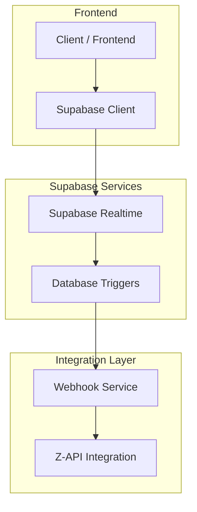
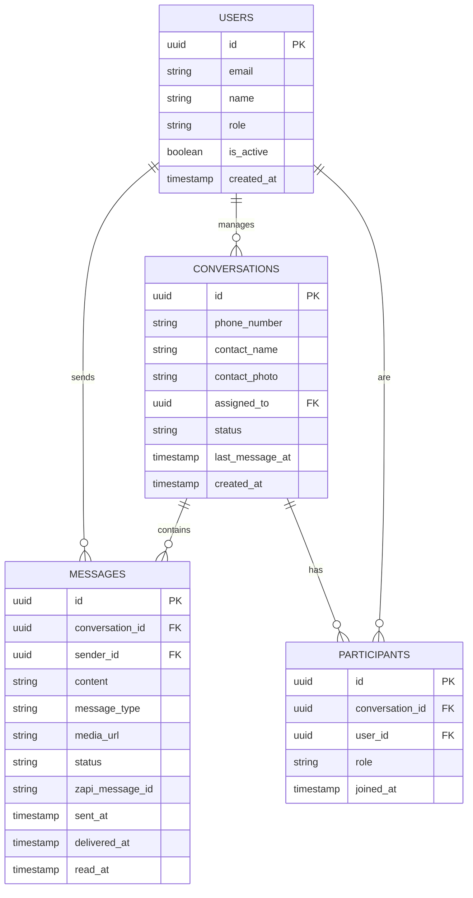

## 1. Architecture design



## 2. Technology Description
- Frontend: React@18 + tailwindcss@3 + vite
- Initialization Tool: vite-init
- Backend: Supabase (PostgreSQL + Realtime + Auth)
- External Integration: Z-API Webhook Service
- Real-time Communication: Supabase Realtime Subscriptions

## 3. Route definitions
| Route | Purpose |
|-------|---------|
| /chat | Página principal do chat com lista de conversas e interface de chat |
| /chat/:conversationId | Chat específico com histórico de mensagens |
| /queues | Gerenciamento de filas de atendimento |
| /settings/integration | Configurações da integração Z-API |
| /login | Autenticação de usuários do sistema |

## 4. API definitions

### 4.1 Z-API Webhook Integration

```
POST /api/webhooks/zapi
```

Request Body:
| Param Name | Param Type | isRequired | Description |
|------------|-------------|-------------|-------------|
| instance | string | true | Identificador da instância Z-API |
| event | string | true | Tipo do evento (message, status, etc) |
| data | object | true | Dados da mensagem ou status |
| sender | string | true | Número do remetente |
| receiver | string | true | Número do destinatário |

Response:
| Param Name | Param Type | Description |
|------------|-------------|-------------|
| status | string | Status do processamento (success/error) |
| processed | boolean | Confirmação de processamento |

Example:
```json
{
  "instance": "instancia01",
  "event": "message",
  "data": {
    "id": "msg123",
    "body": "Olá, preciso de ajuda",
    "type": "chat",
    "timestamp": 1701234567
  },
  "sender": "5511999999999",
  "receiver": "5511888888888"
}
```

### 4.2 Message Status Update

```
PUT /api/messages/:messageId/status
```

Request Body:
| Param Name | Param Type | isRequired | Description |
|------------|-------------|-------------|-------------|
| status | string | true | Novo status (sent, delivered, read) |
| timestamp | number | true | Timestamp do status |

## 5. Server architecture diagram



## 6. Data model

### 6.1 Data model definition



### 6.2 Data Definition Language

**Users Table (users)**
```sql
-- create table
CREATE TABLE users (
  id UUID PRIMARY KEY DEFAULT gen_random_uuid(),
  email VARCHAR(255) UNIQUE NOT NULL,
  name VARCHAR(100) NOT NULL,
  role VARCHAR(20) DEFAULT 'attendant' CHECK (role IN ('admin', 'supervisor', 'attendant')),
  is_active BOOLEAN DEFAULT true,
  created_at TIMESTAMP WITH TIME ZONE DEFAULT NOW()
);

-- grant permissions
GRANT SELECT ON users TO anon;
GRANT ALL PRIVILEGES ON users TO authenticated;
```

**Conversations Table (conversations)**
```sql
-- create table
CREATE TABLE conversations (
  id UUID PRIMARY KEY DEFAULT gen_random_uuid(),
  phone_number VARCHAR(20) NOT NULL,
  contact_name VARCHAR(100),
  contact_photo TEXT,
  assigned_to UUID REFERENCES users(id),
  status VARCHAR(20) DEFAULT 'active' CHECK (status IN ('active', 'archived', 'resolved')),
  last_message_at TIMESTAMP WITH TIME ZONE DEFAULT NOW(),
  created_at TIMESTAMP WITH TIME ZONE DEFAULT NOW()
);

-- create indexes
CREATE INDEX idx_conversations_assigned_to ON conversations(assigned_to);
CREATE INDEX idx_conversations_last_message ON conversations(last_message_at DESC);
CREATE INDEX idx_conversations_status ON conversations(status);

-- grant permissions
GRANT SELECT ON conversations TO anon;
GRANT ALL PRIVILEGES ON conversations TO authenticated;
```

**Messages Table (messages)**
```sql
-- create table
CREATE TABLE messages (
  id UUID PRIMARY KEY DEFAULT gen_random_uuid(),
  conversation_id UUID REFERENCES conversations(id) ON DELETE CASCADE,
  sender_id UUID REFERENCES users(id),
  content TEXT,
  message_type VARCHAR(20) DEFAULT 'text' CHECK (message_type IN ('text', 'image', 'audio', 'document', 'video')),
  media_url TEXT,
  status VARCHAR(20) DEFAULT 'sent' CHECK (status IN ('sent', 'delivered', 'read', 'failed')),
  zapi_message_id VARCHAR(100),
  sent_at TIMESTAMP WITH TIME ZONE DEFAULT NOW(),
  delivered_at TIMESTAMP WITH TIME ZONE,
  read_at TIMESTAMP WITH TIME ZONE,
  created_at TIMESTAMP WITH TIME ZONE DEFAULT NOW()
);

-- create indexes
CREATE INDEX idx_messages_conversation ON messages(conversation_id);
CREATE INDEX idx_messages_created_at ON messages(created_at DESC);
CREATE INDEX idx_messages_status ON messages(status);

-- grant permissions
GRANT SELECT ON messages TO anon;
GRANT ALL PRIVILEGES ON messages TO authenticated;
```

**Participants Table (participants)**
```sql
-- create table
CREATE TABLE participants (
  id UUID PRIMARY KEY DEFAULT gen_random_uuid(),
  conversation_id UUID REFERENCES conversations(id) ON DELETE CASCADE,
  user_id UUID REFERENCES users(id) ON DELETE CASCADE,
  role VARCHAR(20) DEFAULT 'attendant' CHECK (role IN ('attendant', 'supervisor')),
  joined_at TIMESTAMP WITH TIME ZONE DEFAULT NOW(),
  UNIQUE(conversation_id, user_id)
);

-- grant permissions
GRANT SELECT ON participants TO anon;
GRANT ALL PRIVILEGES ON participants TO authenticated;
```

**Row Level Security Policies**
```sql
-- Enable RLS
ALTER TABLE conversations ENABLE ROW LEVEL SECURITY;
ALTER TABLE messages ENABLE ROW LEVEL SECURITY;
ALTER TABLE participants ENABLE ROW LEVEL SECURITY;

-- Conversations policies
CREATE POLICY "Users can view assigned conversations" ON conversations
  FOR SELECT USING (
    assigned_to = auth.uid() OR 
    EXISTS (
      SELECT 1 FROM participants 
      WHERE participants.conversation_id = conversations.id 
      AND participants.user_id = auth.uid()
    )
  );

CREATE POLICY "Users can update assigned conversations" ON conversations
  FOR UPDATE USING (assigned_to = auth.uid());

-- Messages policies
CREATE POLICY "Users can view messages from assigned conversations" ON messages
  FOR SELECT USING (
    EXISTS (
      SELECT 1 FROM conversations 
      WHERE conversations.id = messages.conversation_id 
      AND (conversations.assigned_to = auth.uid() OR
           EXISTS (
             SELECT 1 FROM participants 
             WHERE participants.conversation_id = conversations.id 
             AND participants.user_id = auth.uid()
           ))
    )
  );

CREATE POLICY "Users can insert messages" ON messages
  FOR INSERT WITH CHECK (sender_id = auth.uid());

-- Realtime subscriptions
CREATE PUBLICATION chat_realtime FOR TABLE messages, conversations;
```