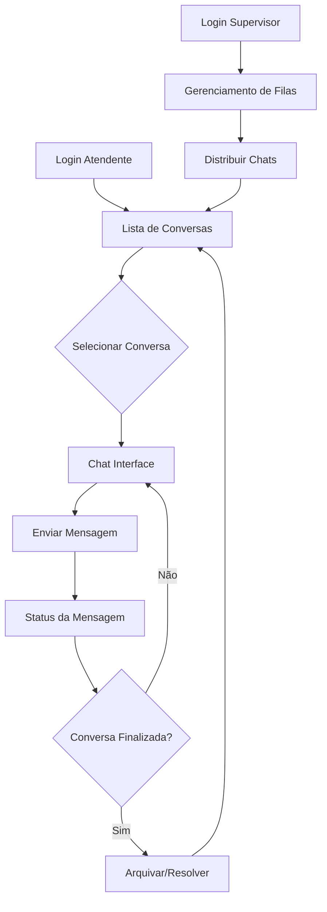

## 1. Product Overview
Sistema de chat em tempo real integrado ao UniCRM, oferecendo comunicação instantânea com status de mensagens (enviada, entregue, lida) e gestão inteligente de conversas. Permite atendimento profissional com múltiplos atendentes, organização de filas e histórico completo de interações.

O produto resolve a necessidade de comunicação eficiente entre empresas e clientes via WhatsApp, com interface profissional e recursos avançados de gestão para equipes de atendimento.

## 2. Core Features

### 2.1 User Roles
| Role | Registration Method | Core Permissions |
|------|---------------------|------------------|
| Atendente | Login via sistema UniCRM | Acessar fila de chats, responder mensagens, arquivar conversas |
| Supervisor | Login via sistema UniCRM | Visualizar todas as filas, distribuir chats, monitorar atendentes |
| Admin | Login via sistema UniCRM | Configurar integrações, gerenciar usuários, acessar relatórios |

### 2.2 Feature Module
O sistema de chat consiste nas seguintes páginas principais:
1. **Lista de Conversas**: Visualização de todas as conversas ativas com preview, status e ordenação inteligente
2. **Chat Interface**: Tela principal de conversa com envio/recebimento em tempo real, status de mensagens e campo de digitação avançado
3. **Gerenciamento de Filas**: Visualização e distribuição de chats entre atendentes
4. **Configurações de Integração**: Painel de configuração da Z-API e webhooks

### 2.3 Page Details
| Page Name | Module Name | Feature description |
|-----------|-------------|---------------------|
| Lista de Conversas | Lista ordenada | Exibir conversas ordenadas por mensagem mais recente, com scroll suave e performance otimizada |
| Lista de Conversas | Indicadores visuais | Mostrar badge de mensagens não lidas, horário da última mensagem e preview do conteúdo |
| Lista de Conversas | Ações de gestão | Permitir excluir, arquivar e marcar como resolvida, com confirmação de ações |
| Lista de Conversas | Busca inteligente | Filtrar conversas por nome ou número de telefone em tempo real |
| Chat Interface | Cabeçalho do contato | Exibir foto, nome e status de conexão do contato |
| Chat Interface | Área de mensagens | Carregar histórico automaticamente, manter scroll no final ao enviar novas mensagens |
| Chat Interface | Status de mensagens | Exibir indicadores visuais de enviada, entregue e lida para cada mensagem |
| Chat Interface | Campo de digitação | Suportar texto, anexos, mídia (imagens, áudios, documentos) e mensagens rápidas |
| Chat Interface | Carregamento incremental | Carregar mensagens antigas quando usuário scrollar para cima |
| Gerenciamento de Filas | Visualização de filas | Mostrar fila pessoal e fila geral com distribuição de chats |
| Gerenciamento de Filas | Assumir conversa | Permitir atendente assumir chat e continuar de onde parou |
| Configurações de Integração | Z-API Config | Gerenciar webhooks, QR code, status e envio de mensagens |

## 3. Core Process
### Fluxo do Atendente
1. Atendente acessa o sistema e visualiza sua fila de chats
2. Seleciona uma conversa não atribuída ou recebe distribuição automática
3. Visualiza histórico completo da conversa carregado automaticamente
4. Envia mensagens de texto, mídia ou utiliza mensagens rápidas
5. Acompanha status das mensagens em tempo real (enviada → entregue → lida)
6. Marca conversa como resolvida ou arquiva quando finalizar atendimento

### Fluxo do Supervisor
1. Supervisor visualiza fila geral com todas as conversas pendentes
2. Distribui chats entre atendentes disponíveis
3. Monitora status de atendentes e volume de atendimentos
4. Acessa conversas para qualidade ou intervenção quando necessário

## 4. User Interface Design
### 4.1 Design Style
- **Cores primárias**: Azul UniCRM (#2563EB) para elementos principais
- **Cores secundárias**: Cinza claro (#F3F4F6) para fundos e divisórias
- **Estilo de botões**: Arredondados com sombra suave, estilo "bolha"
- **Fonte**: Inter ou sistema padrão, tamanhos 14-16px para texto, 12px para horários
- **Layout**: Baseado em cards com bordas arredondadas, fundo neutro não agressivo
- **Ícones**: Estilo clean e minimalista, preferencialmente outline

### 4.2 Page Design Overview
| Page Name | Module Name | UI Elements |
|-----------|-------------|-------------|
| Lista de Conversas | Lista de chats | Cards arredondados com avatar circular, nome em negrito, preview em cinza, badge vermelho para não lidas |
| Lista de Conversas | Header da lista | Barra superior com busca arredondada e botão de filtros |
| Chat Interface | Header do chat | Barra com avatar grande (48px), nome do contato, status online/offline com bolinha verde/cinza |
| Chat Interface | Área de mensagens | Bolhas arredondadas, mensagens do usuário à direita em azul, do contato à esquerda em cinza claro |
| Chat Interface | Status das mensagens | Check duplo azul para lida, check simples cinza para enviada, relógio para pendente |
| Chat Interface | Input de mensagem | Barra inferior arredondada com botão de anexo, campo de texto expansível, botão de envio circular |
| Chat Interface | Anexos | Preview de imagens em grid, documentos com ícone e nome, áudio com player integrado |

### 4.3 Responsiveness
- **Desktop-first**: Otimizado para telas grandes com layout de três colunas (lista, chat, info)
- **Mobile-adaptive**: Layout adaptável para tablets e smartphones com menu hambúrguer
- **Touch optimization**: Botões com área de toque mínima de 44px, gestos de swipe para ações