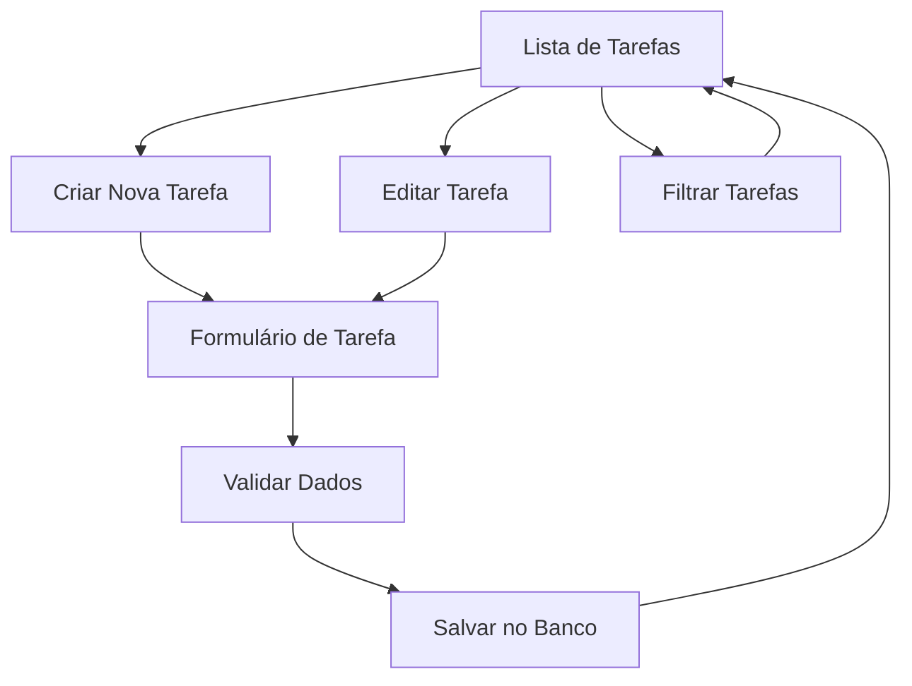

## 1. Visão Geral do Produto
Sistema de gerenciamento de tarefas integrado ao CRM, permitindo criar, editar, filtrar e acompanhar o status das tarefas com persistência em banco de dados.

## 2. Funcionalidades Principais

### 2.1 Páginas do Módulo de Tarefas
Nosso módulo de tarefas consiste nas seguintes páginas principais:
1. **Lista de Tarefas**: visualização principal com filtros e listagem de tarefas.
2. **Criar/Editar Tarefa**: formulário para criar nova tarefa ou editar existente.
3. **Detalhes da Tarefa**: visualização detalhada de uma tarefa específica.

### 2.2 Detalhamento das Páginas
| Nome da Página | Módulo | Descrição das Funcionalidades |
|----------------|---------|------------------------------|
| Lista de Tarefas | Barra de filtros | Filtrar por status (pendente, em andamento, concluída), prioridade (alta, média, baixa), responsável e data de vencimento. |
| Lista de Tarefas | Lista de tarefas | Exibir tarefas em formato de cards ou tabela com: título, descrição resumida, status, prioridade, responsável, data de vencimento e ações rápidas (editar, excluir, marcar como concluída). |
| Lista de Tarefas | Ações em lote | Selecionar múltiplas tarefas e alterar status ou excluir em massa. |
| Criar/Editar Tarefa | Formulário de tarefa | Campos: título (obrigatório), descrição detalhada, status, prioridade, responsável, data de vencimento, anexos. |
| Criar/Editar Tarefa | Validações | Validar campos obrigatórios, datas futuras para vencimento, formato de anexos permitidos. |
| Detalhes da Tarefa | Informações da tarefa | Exibir todos os dados da tarefa: título, descrição completa, status, prioridade, responsável, datas de criação e vencimento, anexos. |
| Detalhes da Tarefa | Histórico de alterações | Registrar e exibir log de alterações: quem modificou, o que mudou, data/hora da alteração. |

## 3. Fluxo Principal de Operações

### Fluxo do Usuário
1. Usuário acessa a lista de tarefas
2. Visualiza tarefas existentes com filtros aplicados
3. Pode criar nova tarefa clicando em "Nova Tarefa"
4. Preenche formulário com dados obrigatórios
5. Sistema valida e salva no banco de dados
6. Usuário pode editar tarefa existente
7. Pode alterar status diretamente na lista
8. Pode filtrar tarefas por diversos critérios

## 4. Design da Interface

### 4.1 Estilo de Design
- **Cores primárias**: Azul corporativo (#2563EB) para ações principais
- **Cores secundárias**: Cinza (#6B7280) para textos secundários
- **Botões**: Estilo arredondado com sombra sutil
- **Fonte**: Inter para melhor legibilidade
- **Tamanhos**: 14px para texto normal, 16px para títulos
- **Layout**: Baseado em cards com espaçamento consistente
- **Ícones**: Feather Icons para consistência visual

### 4.2 Design das Páginas
| Página | Módulo | Elementos de UI |
|--------|---------|-----------------|
| Lista de Tarefas | Filtros | Dropdowns para status, prioridade, responsável; date picker para vencimento; botão "Aplicar Filtros". |
| Lista de Tarefas | Cards de tarefa | Card com borda colorida por prioridade (vermelho=alta, amarelo=média, verde=baixa), badge de status, avatar do responsável. |
| Formulário Tarefa | Campos do formulário | Input de texto para título, textarea para descrição, selects para status/prioridade/responsável, date picker para vencimento, upload de anexos. |
| Formulário Tarefa | Ações | Botões "Salvar" (primário), "Cancelar" (secundário), "Excluir" (perigo, apenas em edição). |

### 4.3 Responsividade
- Desktop-first: otimizado para telas grandes
- Adaptativo para tablets: layout em grid responsivo
- Mobile: cards empilhados verticalmente, filtros em menu lateral
- Touch-friendly: botões com área de toque mínima 44x44px